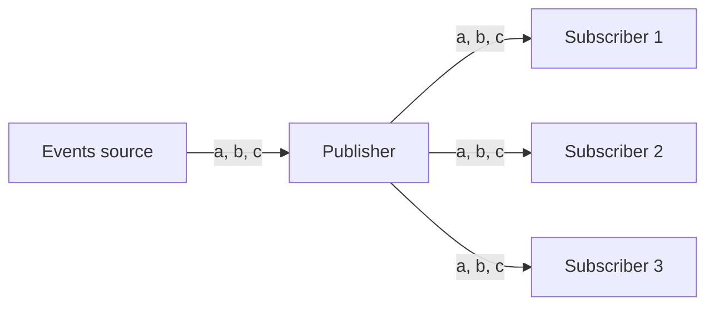
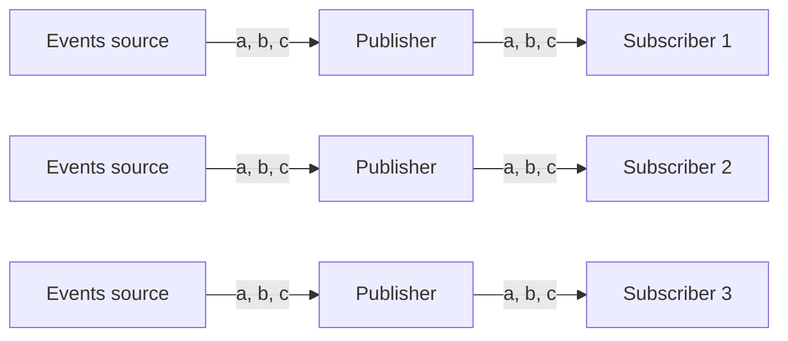

---
tags:
- guide
- beginner
---

# Broadcasting to multiple subscribers (like server-sent events, websockets, etc)

It is a common requirement in event-driven applications to have multiple subscribers receiving events from a single events source:



A good example would be a periodic events stream where the events get pushed every second to multiple [server-sent event](https://developer.mozilla.org/en-US/docs/Web/API/Server-sent_events/Using_server-sent_events) subscribers.

Let us see how this can be done using Mutiny and the [Quarkus framework](https://quarkus.io/).

!!! note

    We use Quarkus to illustrate a classic real-world usage for the broadcast operator, but the same kind of construct
    could be done with another framework or the [Vert.x toolkit](https://vertx.io/).

## Use-case: dynamic subscribers

We expose a HTTP endpoint for server-sent events, and each second we receive the current list of subscribers.
The endpoint is exposed on path `/hello/ticks/{id}` where `id` is an identifier for a subscriber.

We could subscribe and follow the stream using [HTTPie](https://httpie.io/) for subscriber `1`:

```text
$ http --stream :8080/hello/ticks/1
HTTP/1.1 200 OK
Content-Type: text/event-stream
X-SSE-Content-Type: text/plain
transfer-encoding: chunked

data:1

data:1

data:1

data:1,2

data:1,2
```

The first 3 ticks have just one subscriber (`data:1`), but then once another subscriber arrives at path `/hello/ticks/2` we get ticks with identifiers `1,2`. 

When the connection for subscriber `1` closes, we see the impact on subscriber `2`:

```text
http --stream :8080/hello/ticks/2
HTTP/1.1 200 OK
Content-Type: text/event-stream
X-SSE-Content-Type: text/plain
transfer-encoding: chunked

data:1,2

data:1,2

data:2

data:2

data:2
```

## Why is broadcasting required?

Mutiny offers a publisher for periodic event streams:

```java
var ticks = Multi.createFrom().ticks().every(Duration.ofSeconds(1));
```

You might wonder why we couldn't simply build our Quarkus endpoints as in:

```java
@Path("/hello")
public class GreetingResource {
    
    @GET
    @Path("ticks/{id}")
    @RestStreamElementType(MediaType.TEXT_PLAIN)
    public Multi<String> ticks(String id) {
        return Multi.createFrom().ticks().every(Duration.ofSeconds(1))
                // (rest of the pipeline...)
            ;
    }
}
```

The problem here is that instead of having a single events source to emit ticks, you will have as many as there are subscribers:



You might be able to articulate some logic around such construct, but you will end up with many scheduled operations on the Quarkus thread pool.

Even worse: if your source is not periodic ticks emitted by Mutiny but some event source (e.g., a Kafka topic, a message broker queue, etc) then you might add correctness issues (e.g., not all subscribers get all messages).

## Broadcasting, listening to subscriptions and cancellations

It is fortunately quite easy to express such construct by sharing a common `Multi`, and broadcasting events to each subscriber.

Let's start with the HTTP endpoint:

```java
private ConcurrentHashSet<String> identifiers = new ConcurrentHashSet<>();

private Multi<String> ticks = (...);

@GET
@Path("ticks/{id}")
@RestStreamElementType(MediaType.TEXT_PLAIN)
public Multi<String> ticks(String id) {
    Log.info("New client with id " + id);
    identifiers.add(id);
    return ticks.onCancellation().invoke(() -> {
        Log.info("Removing client with id " + id);
        identifiers.remove(id);
    });
}
```

The `ticks` method registers a new client in `identifiers`, and removes it upon cancellation.
The returned `Multi` pipeline piggy-backs on top of the _shared_ `Multi`, which is built as follows:

```java
private Multi<String> ticks = Multi.createFrom().ticks().every(Duration.ofSeconds(1))
        .onItem().transform(tick -> {
            Log.info("tick");
            return identifiers.stream().collect(Collectors.joining(","));
        })
        .onSubscription().invoke(() -> Log.info("Starting to emit ticks"))
        .onCancellation().invoke(() -> Log.info("No more ticks"))
        .broadcast()
            .withCancellationAfterLastSubscriberDeparture()
            .toAtLeast(1);
```

Here are a few observations.

1. For each periodic tick event, we assemble the current subscribers as a string of the form `"1,2,3"` with `.onItem().transform(...)`.
2. We log an event when the periodic event stream starts (see `onSubscription().invoke(...)`).
3. We log an event when the periodic event stream stops (see `onCancellation().invoke(...)`).
4. We broadcast events to all subscribers, but:
   1. there must be at least one subscriber before the stream starts, and
   2. the stream is cancelled when the last subscriber departs.

This construction is quite interesting because we don't emit ticks when there are no subscribers, and we stop it when there are none.

If you play with such an example then you will see logs similar to these:

```text
INFO  [org.acm.GreetingResource] (vert.x-eventloop-thread-0) New client with id 1
INFO  [org.acm.GreetingResource] (vert.x-eventloop-thread-0) Starting to emit ticks
INFO  [org.acm.GreetingResource] (executor-thread-1) tick
INFO  [org.acm.GreetingResource] (executor-thread-1) tick
INFO  [org.acm.GreetingResource] (vert.x-eventloop-thread-0) Removing client with id 1
INFO  [org.acm.GreetingResource] (vert.x-eventloop-thread-0) No more ticks
INFO  [org.acm.GreetingResource] (vert.x-eventloop-thread-1) New client with id 1
INFO  [org.acm.GreetingResource] (vert.x-eventloop-thread-1) Starting to emit ticks
INFO  [org.acm.GreetingResource] (executor-thread-1) tick
INFO  [org.acm.GreetingResource] (executor-thread-1) tick
INFO  [org.acm.GreetingResource] (executor-thread-1) tick
INFO  [org.acm.GreetingResource] (vert.x-eventloop-thread-0) New client with id 2
INFO  [org.acm.GreetingResource] (executor-thread-1) tick
INFO  [org.acm.GreetingResource] (executor-thread-1) tick
INFO  [org.acm.GreetingResource] (vert.x-eventloop-thread-1) Removing client with id 1
INFO  [org.acm.GreetingResource] (executor-thread-1) tick
INFO  [org.acm.GreetingResource] (executor-thread-1) tick
INFO  [org.acm.GreetingResource] (executor-thread-1) tick
INFO  [org.acm.GreetingResource] (vert.x-eventloop-thread-0) Removing client with id 2
INFO  [org.acm.GreetingResource] (vert.x-eventloop-thread-0) No more ticks
```
