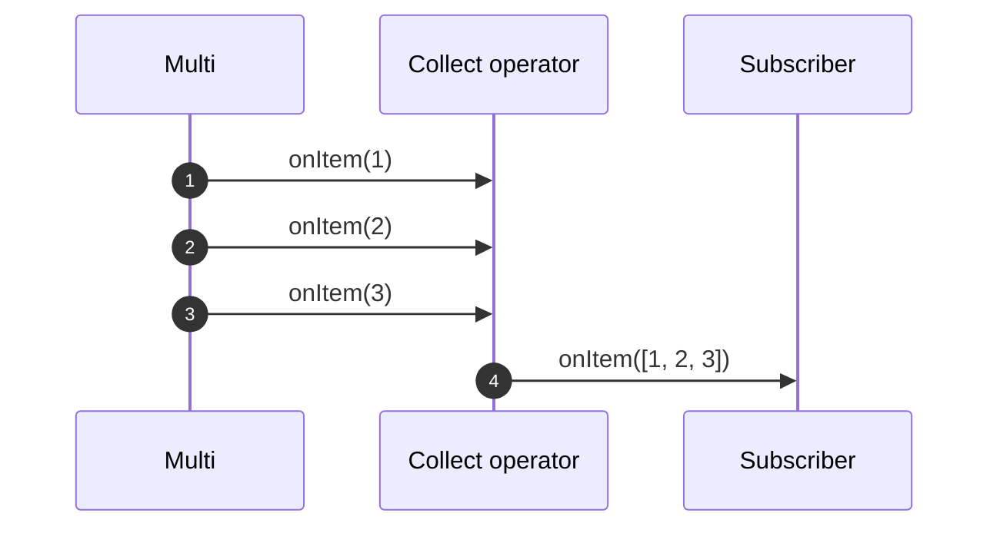

---
tags:
- guide
- beginner
---

# Collecting items from Multi

There are cases where you want to accumulate the items from a `Multi` and produce a `Uni` as a final result.
This is also called a _reduction_ in functional programming.

The `Uni` fires its item when the `Multi` completes.
Mutiny provides multiple operators to deal with that scenario.
They are available from the `collect()` group.
For example, you can store the items in a list, emit the list on completion, or use a Java `Collector` to customize the aggregation.

!!! danger
    
    Don't collect items from infinite streams or you will likely end with an out-of-memory failure!

## Collecting items into a list

One of the most common approaches to collect items is to store them in a list (`Uni<List<T>>`)
It emits the final list when the `Multi` completes.



How to achieve this with Mutiny?

```java linenums="1"
{{ insert('java/guides/operators/CollectingItemsTest.java', 'list') }}
```

It's important to note that the returned type is a `Uni`.
It emits the list when the multi completes.

## Collecting items into a map

You can also collect the items into a `Map`.
In this case, you need to provide a function to compute the key for each item:

```java linenums="1"
{{ insert('java/guides/operators/CollectingItemsTest.java', 'map') }}
```

If the key mapper function returns the same key for multiple items, the last one with that key is stored in the final `Map`.
You can collect items in a _multimap_ to handle items with the same keys.

## Collecting items into a multimap

A multimap is a `Map<K, List<T>>.`
In the case of a conflicting key, it stores all the items in a list associated with that key.

```java linenums="1"
{{ insert('java/guides/operators/CollectingItemsTest.java', 'multimap') }}
```

## Using a custom accumulator

You can also use a custom _accumulator_ function:

```java linenums="1"
{{ insert('java/guides/operators/CollectingItemsTest.java', 'accumulator') }}
```

The `in` method receives two arguments:

1. a supplier providing the new instance of your collection/container
2. the accumulator function

You can also use a Java `Collector`.
For example, in the next example, count the number of items, and produce the final count as item:

```java linenums="1"
{{ insert('java/guides/operators/CollectingItemsTest.java', 'collector') }}
```

## Getting the first and last items

While they are not strictly speaking collecting items, `collect().first()` and `collect().last()` allow retrieving the first and last item from a `Multi`:

```java linenums="1"
{{ insert('java/guides/operators/CollectingItemsTest.java', 'first') }}
```
