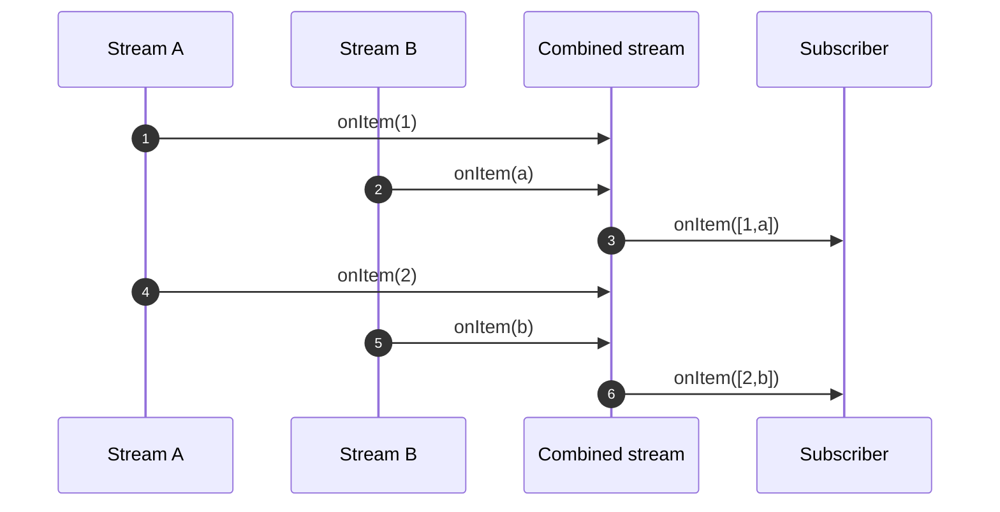
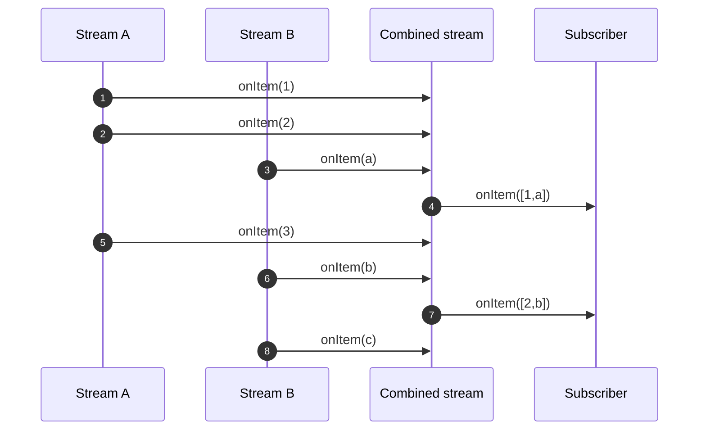
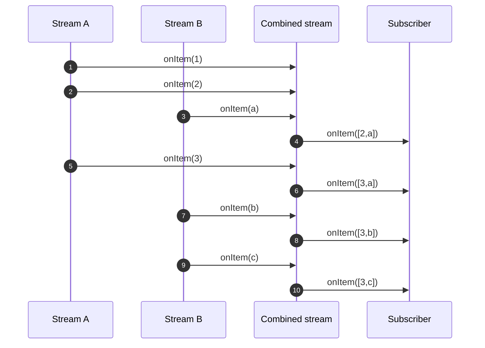

---
tags:
- guide
- intermediate
---

# Combining items from streams

Combining items from various streams is an essential pattern in Reactive Programming.

It associates the emitted items from multiple streams and emits an _aggregate_.
The downstream receives this _aggregate_ and can handle it smoothly.

There are plenty of use cases, such as executing two tasks concurrently and waiting for both completions, getting the last items from different streams to build an always up-to-date view, and so on.

## Combining Unis

Imagine that you have two asynchronous operations to perform like 2 HTTP requests.
You want to send these requests and be notified when both have completed with their responses ready to be consumed.

Of course, you could send the first request, wait for the response, and then send the second request.
If both requests are independent, we can do something better: send both concurrently and await for both completions!



How can you achieve this with Mutiny?

First, each request is a `Uni`, so we have:

```java linenums="1"
{{ insert('java/guides/operators/CombiningItemsTest.java', 'invocations') }}
```

Then, we want to combine both _responses_:

```java linenums="1"
{{ insert('java/guides/operators/CombiningItemsTest.java', 'combination') }}
```

This code creates a new `Uni` produced by combining `uniA` and `uniB`.
The responses are aggregated inside a `Tuple`:

```java linenums="1"
{{ insert('java/guides/operators/CombiningItemsTest.java', 'subscription') }}
```

The `tuple` aggregates the responses in the same order as the `Uni` sequence.

If one of the `Uni` fails, so does the combination and you receive the failure:

```java linenums="1"
{{ insert('java/guides/operators/CombiningItemsTest.java', 'invocations') }}
{{ insert('java/guides/operators/CombiningItemsTest.java', 'combination') }}
{{ insert('java/guides/operators/CombiningItemsTest.java', 'subscription') }}
```

Using tuples is convenient but only works if you have less than 10 `Uni` objects.
If you want another structure or deal with 10 `Uni` objects or more then use `combineWith`:

```java linenums="1"
{{ insert('java/guides/operators/CombiningItemsTest.java', 'combined-with') }}
```

## Combining Multis

Combining `Multis` consists of associating items from different stream per _index_:



It associates the first items from the combined streams, then the second items:

```java linenums="1"
{{ insert('java/guides/operators/CombiningItemsTest.java', 'combine-multi') }}
```

As for `Uni`, you can aggregate the item into tuples (up to 9 items) or combine with a combinator function:

```java linenums="1"
{{ insert('java/guides/operators/CombiningItemsTest.java', 'combine-multi-with') }}
```

If one of the streams fails, the combined stream propagates the failure and stops the emission.
The combined stream completes as soon as one of the observed stream sends the completion event.

!!! note
    
    If one of the observed streams never emits any item then the combined stream will not emit anything.

## Combining the latest items of Multis

It can be useful to combine multiple `Multi` streams and receive the _latest_ items from each stream on every emission:




This is achieved using `latest()`:

```java linenums="1"
{{ insert('java/guides/operators/CombiningItemsTest.java', 'combine-last') }}
```
