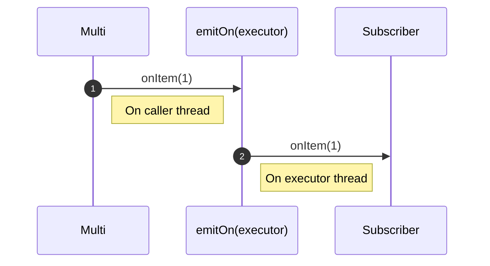
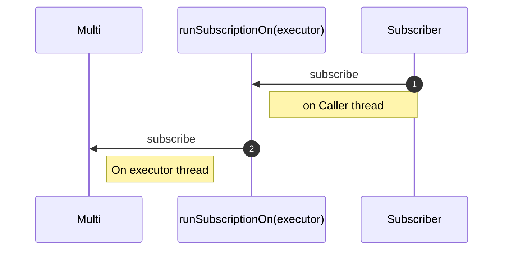

---
tags:
- guide
- intermediate
---

# What is the difference between emitOn and runSubscriptionOn?

The `emitOn` and `runSubscriptionOn` are 2 operators influencing on which threads the event are dispatched.
However, they target different types of events and different directions.

## The case of emitOn

`emitOn` takes events coming from upstream (items, completion, failure) and replays them downstream on a thread from the given executor.
Consequently, it affects where the subsequent operators execute (until another `emitOn` is used):

```java linenums="1"
{{ insert('java/guides/operators/RunSubscriptionOnTest.java', 'emitOn') }}
```

The previous code produces the following sequence:



!!! warning

    Be careful as this operator can lead to concurrency problems with non thread-safe objects such as CDI request-scoped beans.
    It might also break reactive-streams semantics with items being emitted concurrently.

## The case of runSubscriptionOn

`runSubscriptionOn` applies to the subscription process.
It requests the upstream to run its subscription (call of the `subscribe` method on its own upstream) on a thread from the given executor:

```java linenums="1"
{{ insert('java/guides/operators/RunSubscriptionOnTest.java', 'runSubscriptionOn') }}
```

So, if we consider the previous code snippet, it produces the following sequence:

