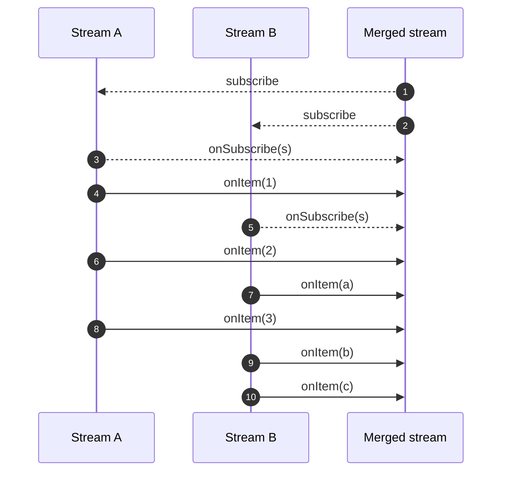
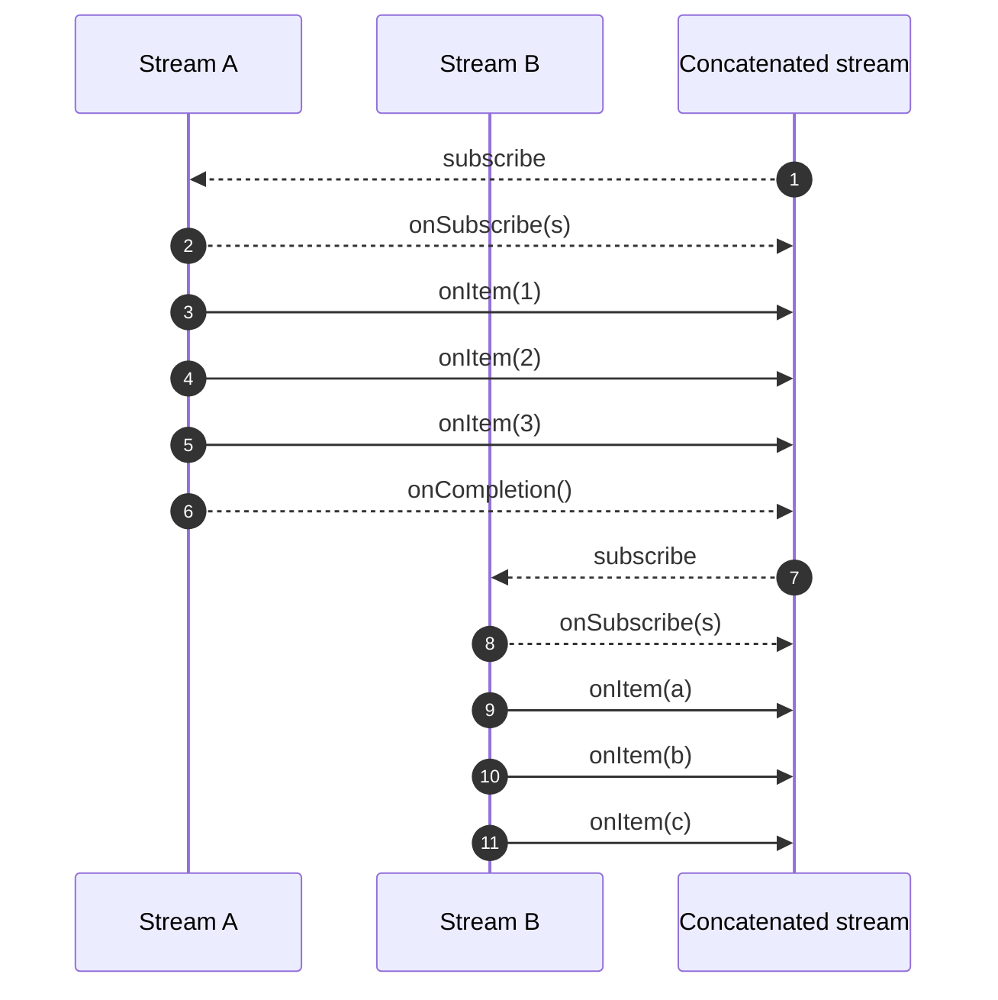

---
tags:
- guide
- intermediate
---

# Merging and Concatenating Streams

Merging or concatenating streams is a frequent operation which consists in taking multiple streams and creating a new `Multi` out of them.
Such an operation observes the items emitted by the different streams and produces a new `Multi` emitting the events.

All the streams merged or concatenated this way should emit the same type of items.

## The difference between merge and concatenate

Understanding the difference between _merge_ and _concatenate_ is essential.

When _merging_ streams, it observes the different upstreams and emits the items as they come.
If the streams emit their items concurrently, the items from the different streams are interleaved.



When using _merge_, failures are also propagated to the merged stream, and no more items are emitted after that failure.
The _completion_ event is only emitted by the merged stream when all the observed streams are completed.

But if we want to keep the order of the observed stream, we need to _concatenate_.

When _concatenating_, it waits for the first stream to complete before subscribing to the second one. Thus, it ensures that all the items from the first stream have been emitted before emitting the second stream items. It preserves an order corresponding to the source:



When the first stream emits the completion event, it switches to the second stream, and so on.
When the last stream completes, the concatenated stream sends the completion event.
As for _merge_, if a stream fails then there won't be further events.

## Merging Multis

To create a new `Multi` from the _merge_ of multiple `Multi` streams use:

```java linenums="1"
{{ insert('java/guides/operators/MergeConcatTest.java', 'merge') }}
```

For example, we can merge multiple streams emitting periodical events:

```java linenums="1"
{{ insert('java/guides/operators/MergeConcatTest.java', 'merge-ticks') }}
```

and the output would be similar to:

```text
Got item: Stream 1 - 0
Got item: Stream 2 - 0
Got item: Stream 3 - 0
Got item: Stream 3 - 1
Got item: Stream 1 - 1
Got item: Stream 3 - 2
Got item: Stream 2 - 1
Got item: Stream 3 - 3
Got item: Stream 1 - 2
Got item: Stream 3 - 4
Got item: Stream 3 - 5
```

## Concatenating Multis

To create a new `Multi` from the _concatenation_ of multiple `Multi` streams use:

```java linenums="1"
{{ insert('java/guides/operators/MergeConcatTest.java', 'concat') }}
```

Don't forget that the streams order matters in this case, as `(streamA, streamB)` does not provide the same result as `(streamB, streamA)`:

```java linenums="1"
{{ insert('java/guides/operators/MergeConcatTest.java', 'concatenate-strings') }}
```

!!! important
    
    If one of the concatenated streams is unbounded (infinite), the next streams in the list won't be consumed!

