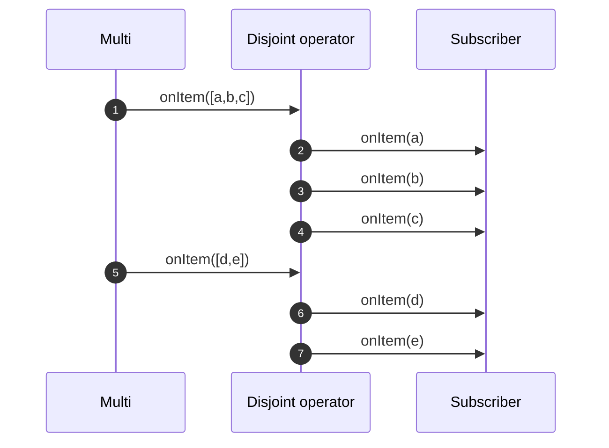

---
tags:
- guide
- intermediate
---

# How to use paginated APIs?

There are many REST / HTTP APIs using pagination, _i.e._ return only a subset of the results and you need to request the next _page_ to get the next batch.
Each batch contains a list of item(s).

To use this kind of API and generate a continuous stream of items, you need to use the `Multi.createBy().repeating()` function.
However, we need to pass a cursor / state to advance and avoid requesting again and again the same page.
Fortunately, `repeating` provides methods to pass a shared state.
So by combining these methods and `disjoint` you can generate streams from these pages:

```java linenums="1"
{{ insert('java/guides/operators/PaginationTest.java', 'code') }}
```

First, you create a `Multi` containing the items emitted by the `CompletionStage` supplier and pass a state supplier to progress among the pages.

Then, use `until` to call the paginated API until we have all the items.
At the point we have a stream of list of item such as `["a", "b", "c"], ["d", "e"], []`.
However, we want the following stream: `"a", "b", "c", "d", "e"`.
The `disjoint` method does exactly this.
It gets the items from the lists and passes them downstream:



`Multi.createBy().repeating()` lets you choose the number of iterations using:

- `atMost` - exact number of repetitions (or failure happens before reaching that number)
- `until` - the repetition is stopped if the item emitted by the `Uni` **passes** a test (predicate).
  It does not propagate the item that did pass the check, and it stops the repetition.
  The check verifies if the current item does not contain valid data.
- `whilst` - the repetition is stopped if the item emitted by the `Uni` **does not pass** a test (predicate).
  It does propagate the item downstream even if the check does not pass.
  However, it stops the repetition.
  The test verifies if there is a _next_ batch to be retrieved.

The following code illustrates the usage of `whilst`:

```java linenums="1"
{{ insert('java/guides/operators/PaginationTest.java', 'code2') }}
```