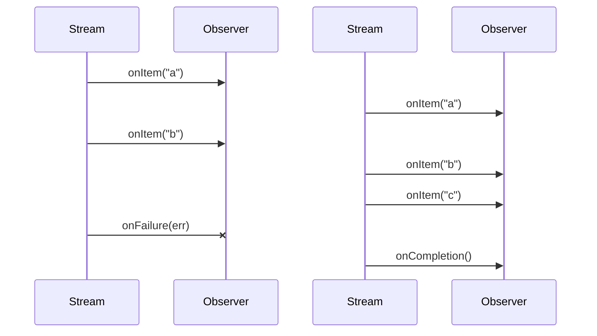

---
tags:
- reference
- beginner
---

# What is Reactive Programming?

Mutiny is a reactive programming library.
If you look on Wikipedia for reactive programming, you will find the following definition:

> Reactive Programming combines functional programming, the observer pattern, and the iterable pattern.

While correct, we never found this definition very helpful.
It does not convey clearly what's reactive programming is all about.
So, let's make another definition, much more straightforward:

> Reactive programming is about programming with data streams.

That's it.
Reactive programming is about streams and especially, observing them.
It pushes that idea to its limit: with reactive programming, everything is a data stream.

With reactive programming, you observe streams and implement side effects when _something_ flows in the stream:

It's asynchronous by nature as you don't know when the _data_ is going to be seen.
Yet, reactive programming goes beyond this.
It provides a toolbox to compose streams and process events.
