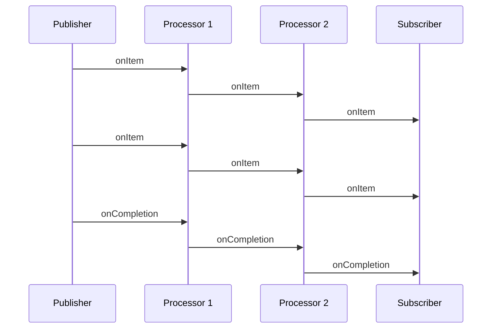
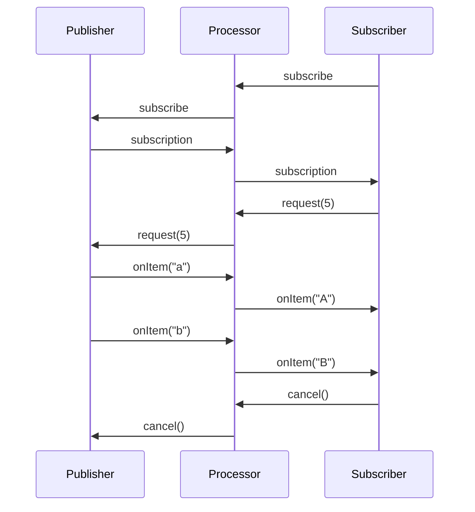

---
tags:
- reference
- beginner
---

# What makes Mutiny different?

There are other reactive programming libraries out there.
In the Java world,  we can mention Project Reactor and Rx Java.

So, what makes Mutiny different from these two well-known libraries?
**The API!**

Asynchronous is hard to grasp for most developers, and for good reasons.
Thus, the API must not require advanced knowledge or add cognitive overload.
It should help you design your logic and still be intelligible when you return to the code 6 months later.

To achieve this, Mutiny is built on three pillars:

- **Event-Driven** - with Mutiny, you listen for _events_ and handle them,
- **API Navigability** - based on the event-driven nature, the API is built around the type of events and drive the navigation based on the kind of event you want to handle,
- **Simplicity** - Mutiny provides only two types (`Multi` and `Uni`), which can handle any kind of asynchronous interactions.

## Events?

When you use Mutiny, you design a pipeline in which the events flow.
Your code observes these events and react.

Each processing stage is a new pipe you append to the pipeline.
This pipe may change the events, create new ones, drops, buffers, whatever you need.

In general, events flow from upstream to downstream, from source to sinks.
Some events can _swim_ upstream from the sinks to the source.

Events going from upstream to downstream are published by `Publishers` and consumed by (downstream) `Subscribers,` which may also produce events for their own downstream, as illustrated by the following diagram:



Four types of events can flow in this direction:

- **Subscribed** - indicates that the upstream has taken into account the subscription - more on this later,
- **Items** - events containing some (business) _value_,
- **Completion** - event indicating that the source won't emit any more items,
- **Failure** - event telling that something terrible happened upstream and that the source cannot continue to emit items.

`Failure` and `Completion` are terminal events.
Once they are sent, no more items will flow.

Three types of events flow in the opposite direction, _i.e._ from downstream to upstream:

- **Subscription** - event sent by a _subscriber_ to indicate its interest for the events (such as items) emitted by upstream
- **Requests** - event sent by a _subscriber_ indicating how many items event it can handle - this is related to back-pressure
- **Cancellation** - event sent by a _subscriber_ to stop the reception of events.

In a typical scenario:

1. A subscriber _subscribes_ to the upstream - the upstream receive the `subscription request`, and when initialized sends the `subscribed` event to the subscriber
2. The subscriber gets the `subscribed` event with a _subscription_ used to emit the `requests` and `cancellation` events
3. The subscriber sends a `request` event indicating how many items it can handle at this moment; it can request 1, _n_, or infinite.
4. The publisher receiving the `request` event starts emitting at most _n_ item events to the subscriber
5. The subscriber can decide at any time to request more events or to cancel the subscription



The `request` event is the cornerstone of the back-pressure protocol.
A subscriber should not request more than what it can handle, and a publisher should not emit more items than the amount of request received.

!!! note
    
    Mutiny uses the [Reactive Streams](https://www.reactive-streams.org/) protocol for back-pressure management and the [Java Flow APIs](https://docs.oracle.com/en/java/javase/11/docs/api/java.base/java/util/concurrent/Flow.html).

!!! important
    
    Don't forget to subscribe!

    If no subscriber _subscribes_, no items will be emitted.
    More importantly, nothing will ever happen.

    If your program does not do anything, check that it subscribes, it's a very common error.

## An event-driven API?

Mutiny is an event-driven API.

For each type of event, there is an `on` associated method that lets you handle this specific event.
For example:

```java linenums="1"
{{ insert('java/guides/EventsTest.java', 'code') }}
```

Of course, the methods presented in this snippet are not very interesting, although they are quite useful to trace what's going on.

You can see a common pattern emerging:

```java
.onEvent().invoke(event -> ...);
```

`invoke` is just one of the methods available.
Each _group_ proposes methods specific to the type of event. For example, `onFailure().recover`, `onCompletion().continueWith` and so on.
