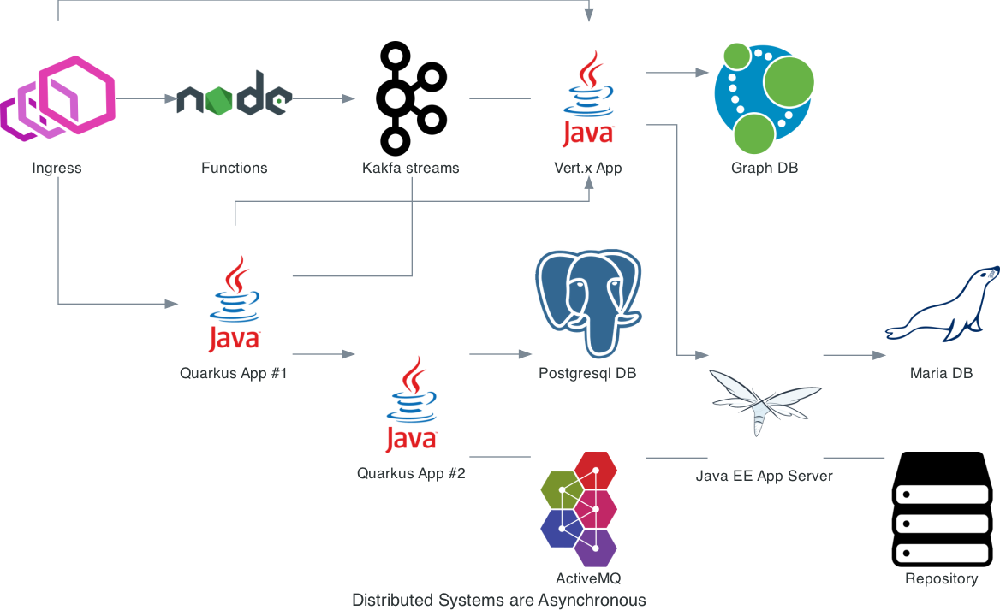

---
tags:
- reference
- beginner
---

# Why is asynchronous important?

We are living in a distributed world.

Most of the applications built nowadays are distributed systems.
The Cloud, IoT, microservices, mobile application, even simple CRUD applications are distributed applications.

Still, developing distributed systems is hard!

Communications in distributed systems are inherently asynchronous and unreliable.
Anything can go wrong, anytime, and often with no prior notice.

Network disruptions, unavailable services, software, or hardware failures are just a tiny subset of the wide variety of failures that can happen in distributed systems.

_Correctly_ building distributed applications is a considerable challenge, as it requires re-assessing almost everything we know from traditional software development.

Most classic applications use a synchronous development model.
Synchronous code is easy to reason about, more comfortable to write and read than asynchronous code, but it has some hidden cost.
This cost emerges when building I/O intensive applications, quite common in distributed applications.

In general, these traditional applications assign one thread per request, and so they handle multiple concurrent requests with multiple threads.
When the request processing needs to interact over the network, it uses that _worker_ thread, which blocks the thread until the response has been received.
This response may never come, so you need to add watchdogs handling timeouts and other resilience patterns.
And, to handle more requests concurrently, you need to create more threads.

Threads come at a cost.
Each thread requires memory, and the more threads you have, the more CPU cycles are used to handle the context switches.
Thus, this model ends up being costly, limits the deployment density, and on the Cloud means that you pay bigger bills.

Fortunately, there is another way, and it relies on non-blocking I/O, an efficient way to handle I/O interactions that do not require additional threads.
While applications using non-blocking I/O are more efficient and better suited for the Cloud's distributed nature, they come with a considerable constraint: you must never block the I/O thread.   
Thus, you need to implement your business logic using an asynchronous development model.

I/O is not the only reason why asynchronous is essential in Today's systems.
Most of the interactions in the real world are asynchronous and event-driven.
Representing these interactions using synchronous processes is not only wrong; it also introduces fragility in your application.

Asynchronous is a significant shift.
Mutiny helps you to take the plunge.
