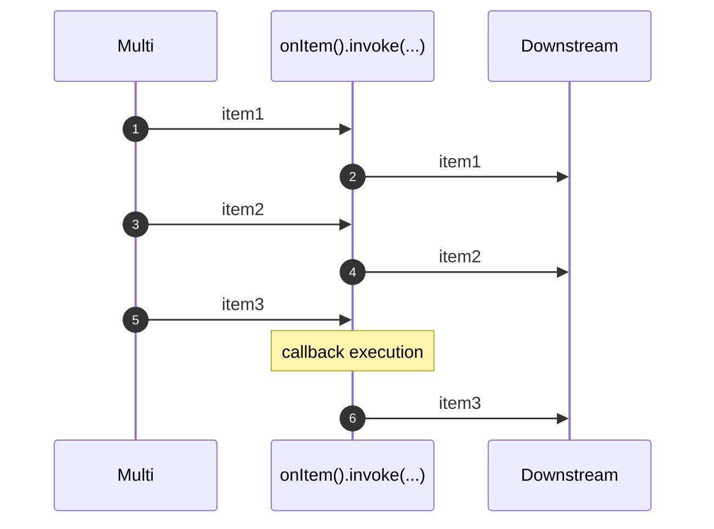
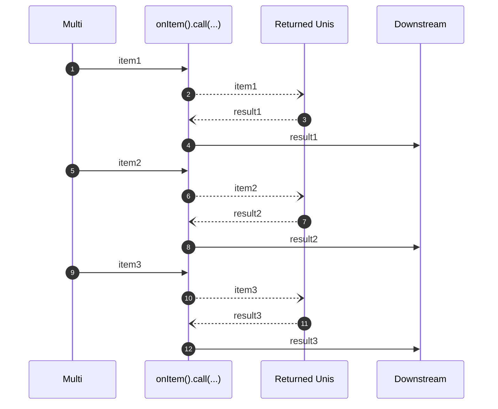

---
tags:
- tutorial
- beginner
---

# Observing events

Learn how to observe the events emitted by `Uni` and `Multi` instances.

## Events

`Uni` and `Multi` emit _events_.
Your code is going to observe and process these events.

Most of the time, your code is only interested in item and failure events.
But there are other kinds of events such as cancellation, request, completion, and so on:

|             Event | Uni / Multi   | Direction               | Note                                                                                                    |
|------------------:|---------------|:------------------------|:--------------------------------------------------------------------------------------------------------|
|          **item** | Uni + Multi   | upstream -> downstream  | The upstream sent an item.                                                                              |
|       **failure** | Uni + Multi   | upstream -> downstream  | The upstream failed.                                                                                    |
|    **completion** | Multi         | upstream -> downstream  | The upstream completed.                                                                                 |
|     **subscribe** | Uni and Multi | downstream -> upstream  | A downstream subscriber is interested in the data.                                                      |
|  **subscription** | Uni and Multi | upstream -> downstream  | Event happening after a `subscribe` event to indicate that the upstream acknowledged the subscription.  |
|  **cancellation** | Uni and Multi | downstream -> upstream  | A downstream subscriber does not want any more events.                                                  |
|      **overflow** | Multi         | upstream -> downstream  | The upstream has emitted more than the downstream can handle.                                           |
|       **request** | Multi         | downstream -> upstream  | The downstream indicates its capacity to handle `n` items.                                              |


It’s not rare that you need to look at these various events to understand better what’s going on or implement specific side effects.
For example, you may need to close a resource after a completion event or log a message on failure or cancellation.

For each kind of event, there is an associated group providing the methods to handle that specific event: `onItem()`, `onFailure()`, `onCompletion()` and so on.
These groups provide two methods to _peek_ at the various events without impacting its distribution: `invoke(...)` and `call(...)`.
It does not transform the received event; it notifies you that something happened and let you react.
Once this _reaction_ completes, the event is propagated downstream or upstream depending on the direction of the event.

## The `invoke` method

The invoke method is synchronous and the passed callback does not return anything.
Mutiny invokes the configured callback when the observed stream dispatches the event:

```java linenums="1"
{{ insert('java/tutorials/ObserveTest.java', 'invoke') }}
```

As said above, `invoke` is synchronous.
Mutiny invokes the callback and propagates the event downstream when the callback returns.
It blocks the dispatching.



Of course, we highly recommend you not to block.

The following snippets show how you can log the different types of events.

```java linenums="1"
{{ insert('java/tutorials/ObserveTest.java', 'invoke-all') }}
```

The arrows from the previous code snippet indicate if the event comes from the upstream (source) or downstream (consumer) (see the table above for more details).
The `invoke` method does not change the event, except in one case.
If the callback throws an exception, the downstream does not get the actual event but get a failure event instead.

When observing the failure event, if the callback throws an exception, Mutiny propagates a `CompositeException` aggregating the original failure and the callback failure.

## The `call` method

Unlike `invoke`, `call` is asynchronous, and the callback returns a `Uni<?>` object.

`call` is often used when you need to implement asynchronous side-effects, such as closing resources.



Mutiny does not dispatch the original event downstream until the Uni returned by the callback emits an item:

```java linenums="1"
{{ insert('java/tutorials/ObserveTest.java', 'call') }}
```

As shown in the previous snippet, you can use this approach to delay items.
But, the primary use case is about completing asynchronous actions such as calling an asynchronous `close` method on a resource:

```java linenums="1"
{{ insert('java/tutorials/ObserveTest.java', 'close') }}
```

Under the hood, Mutiny gets the `Uni` (by invoking the callback) and subscribes to it.
It observes the item or failure event from that Uni.
It discards the item value as only the emission matters in this case.

If the callback throws an exception or the produced `Uni` produces a failure, Mutiny propagates that failure (or a `CompositeException`) downstream, replacing the original event.

## Summary

- The `invoke` and `call` methods are handy when you need to observe a `Uni` or a `Multi` without changing the transiting events.
- Use `invoke` for implementing synchronous side-effects or logging events.
- The asynchronous nature of `call` makes it perfect for implementing asynchronous side-effects, such as closing resources, flushing data, delay items, and so on.

The following table highlights the key differences:

|                     | `invoke`                          | `call`                                           |
|--------------------:|:----------------------------------|:-------------------------------------------------|
|          **Nature** | synchronous                       | asynchronous                                     |
|     **Return type** | `void`                            | `Uni<T>`                                         |
|  **Main use cases** | logging, synchronous side-effects | I/O operations, closing resources, flushing data |

