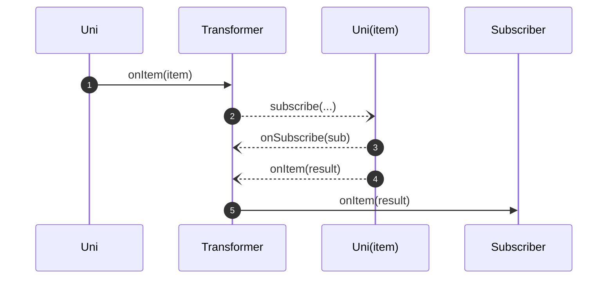
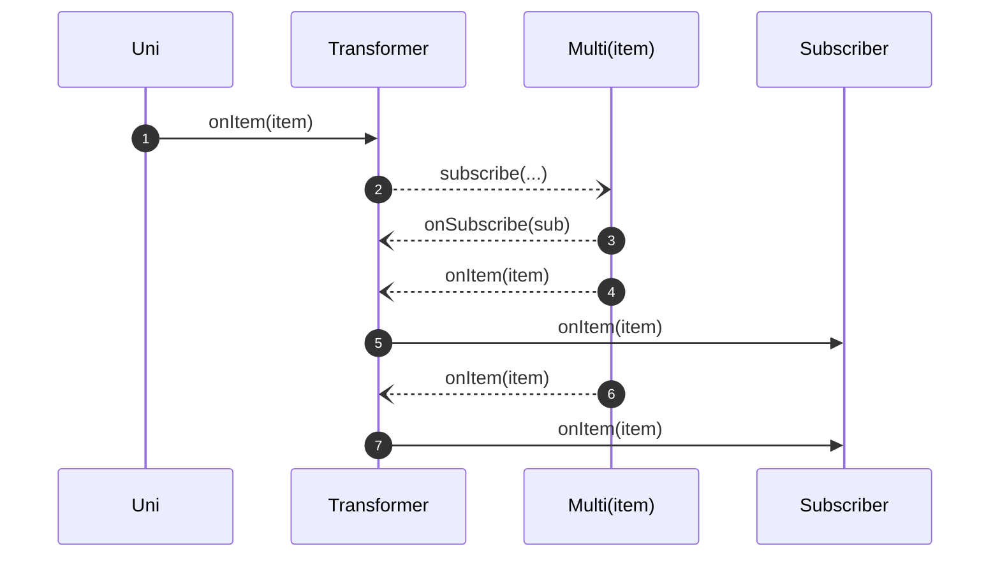

---
tags:
- tutorial
- beginner
---

# Transforming items asynchronously

The previous examples illustrated how to transform each item from a stream into another item.
Yet, there are cases where we need to go beyond this, for example:

- Transforming an item into a `Uni` -- any asynchronous processing such as calling a remote service, interacting with a database, etc
- Transforming an item into a `Multi` -- producing a multi-items stream based on the incoming item, filtering out items, etc

Having the possibility to transform an item into a stream gives us many opportunities.
To implement such transformations, we use `onItem().transformToUni(Function<T, Uni<O>>)` and `onItem().transformToMulti(Function<T, Multi<O>>)`

## Uni - Transforming an item into a Uni



Imagine that you have a `Uni<String>`, and you want to call a remote service.

Calling a remote service is an asynchronous action represented by a `Uni`, as in:

```java linenums="1"
{{ insert('java/tutorials/TransformItemsAsyncTest.java', 'service') }}
```

To call this service, you need to transform the item received from the first `Uni` into the `Uni` returned by the service:

```java linenums="1"
{{ insert('java/tutorials/TransformItemsAsyncTest.java', 'call') }}
```

This snippet _chains_ the first `Uni` with another one.
The returned `Uni` (`result`) emits the result from the remote service or a failure if anything wrong happened:

```java linenums="1"
{{ insert('java/tutorials/TransformItemsAsyncTest.java', 'chain') }}
```

## Uni - Transforming an item into a Multi

The previous example produced a single item.
You may want to transform the received item into a stream which is... a `Multi`!

```java linenums="1"
{{ insert('java/tutorials/TransformItemsAsyncTest.java', 'uni-to-multi') }}
```

This code creates a stream of two elements, duplicating the received item.

```java linenums="1"
{{ insert('java/tutorials/TransformItemsAsyncTest.java', 'uni-to-multi-2') }}
```



The produced `Multi` objects can of course be more complicated than that and emit items in an asynchronous fashion.

## Transforming items from Multi - the _merge_ vs _concatenate_ dilemma

When transforming items emitted by an upstream `Multi,` we need to answer the following question: how are we going to _merge_ the produced items back?

Let's take an example.
Imagine a `Multi` emitting the `Cameron` and `Donna` items (in order), and you want to call the `invokeRemoteGreetingService` from above.
It thus calls `invokeRemoteGreetingService("Cameron")` then `invokeRemoteGreetingService("Donna")`.

The service does not have a constant response time (because of network latency or the load), which means that responses can be interleaved.
Indeed, you may receive `"Hello Donna"` before `"Hello Cameron"`.

Now, how do you want to handle this case?
Do you need to preserve the order and ensure that the downstream subscriber will always get `"Hello Cameron"` first, or do you accept interleaved responses?

When transforming items from `Multi` into streams, you need to decide in which order the items emitted by the produced stream are going to be received by the downstream subscriber.
Mutiny offers two possibilities:

1. **Merging** -- it does not preserve the order and emits the items from the produced streams as they come, or
2. **Concatenating** -- it maintains and concatenates the streams produced for each item.

## Multi - Transforming an item into a Uni

To implement the scenario from the last section, you will use `onItem().transformToUniAndMerge` or `onItem().transformToUniAndConcatenate()` depending on your ordering choice:

```java linenums="1"
{{ insert('java/tutorials/TransformItemsAsyncTest.java', 'merge-concat') }}
```

!!! important
    
    - When merging: items from the source `Multi` _may_ be processed **concurrently** depending on the concurrency level that has been set, if any.
    - When concatenating: items from the source `Multi` are processed **in order**, waiting for each `Uni` to complete before moving on to the next item. 

## Multi - Transforming an item into a Multi

`onItem().transformToMultiAndMerge` and `onItem().transformToMultiAndConcatenate` transform incoming items into `Multi` streams.
The produced `Multi` objects are either _merged_ or _concatenated_:

```java linenums="1"
{{ insert('java/tutorials/TransformItemsAsyncTest.java', 'merge-concat-multi') }}
```
