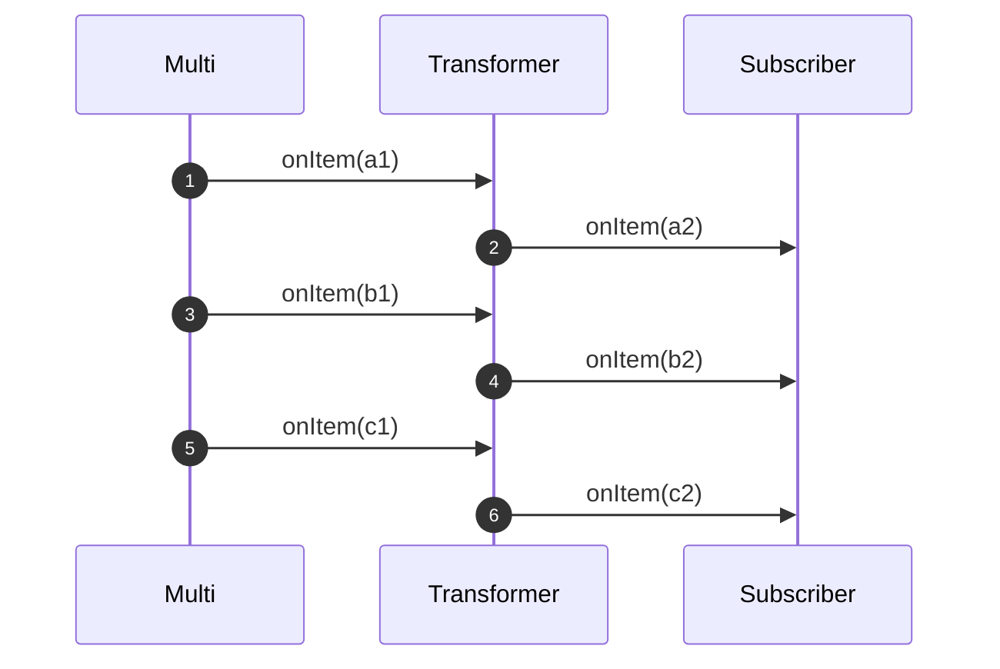

---
tags:
- tutorial
- beginner
---

# Transforming items

Both `Unis` and `Multis` emit _items_.

One of the most common operations you will do is transforming these items using a _synchronous_ 1-to-1 function.

To achieve this, you use `onItem().transform(Function<T, U>)`.
It calls the passed function for each item and produces the result as an item which is propagated downstream.



## Transforming items produced by a Uni

Let's imagine you have a `Uni<String>,` and you want to capitalize the received `String`.
Implementing this transformation is done as follows:

```java linenums="1"
{{ insert('java/tutorials/TransformItemsTest.java', 'uni-transform') }}
```

## Transforming items produced by a Multi

The only difference for `Multi` is that the function is called for each item:

```java linenums="1"
{{ insert('java/tutorials/TransformItemsTest.java', 'multi-transform') }}
```

The produced items are passed to the downstream subscriber:

```java linenums="1"
{{ insert('java/tutorials/TransformItemsTest.java', 'multi-transform-2') }}
```

## What if the transformation failed?

If the transformation throws an exception, that exception is caught and passed to the downstream subscriber as a _failure_ event.
It also means that the subscriber won't get further item after that failure.

## Chaining multiple transformations

You can chain multiple transformations:

```java linenums="1"
{{ insert('java/tutorials/TransformItemsTest.java', 'chain') }}
```
